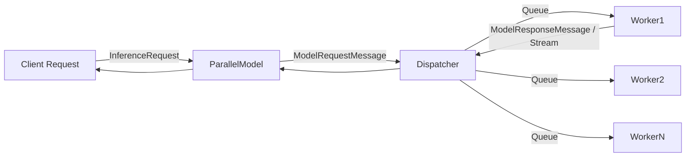
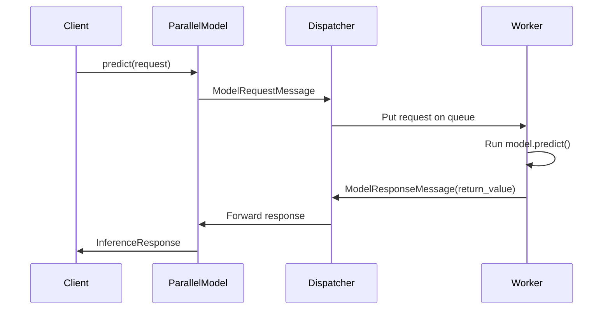
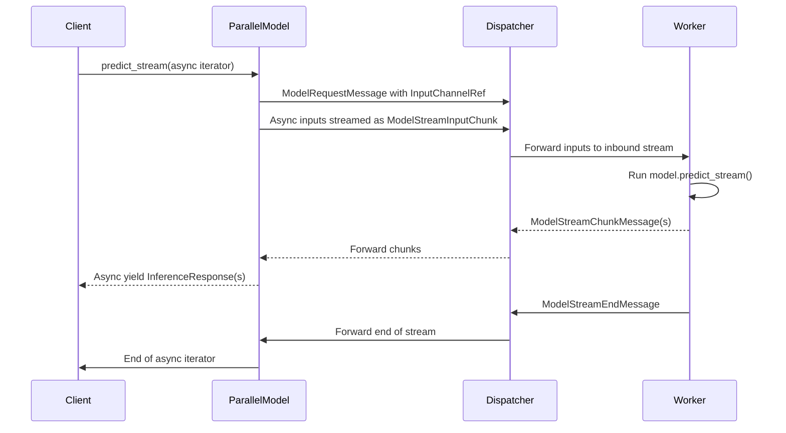
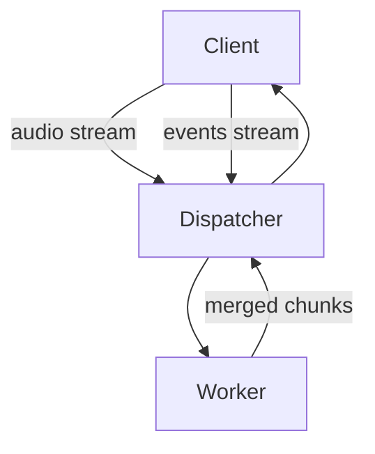
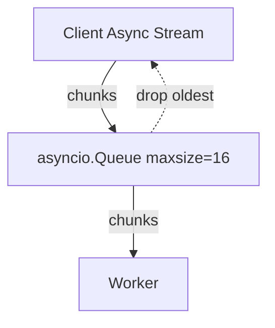
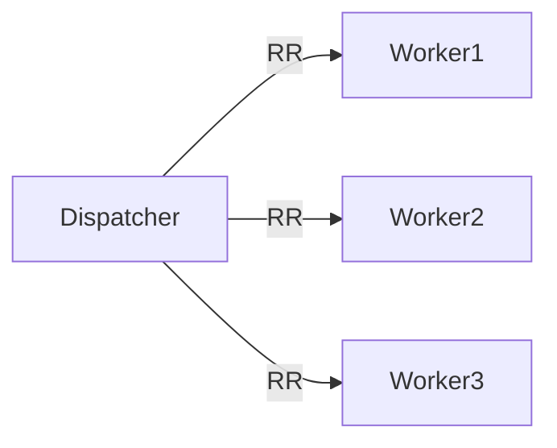
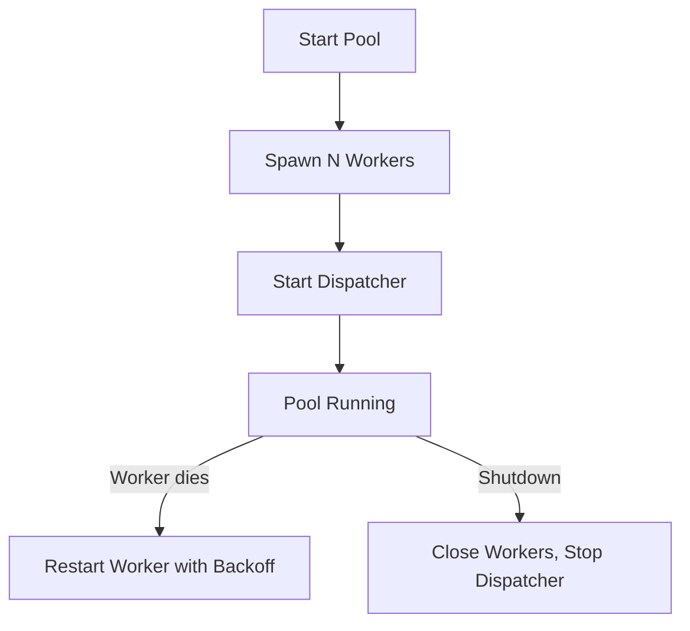

# Parallelization in WOPRserver

This document explains the **parallel execution subsystem** of WOPRserver. It covers the architecture, the main components, message flow, backpressure/concurrency control, and how requests are distributed across multiple worker processes. Diagrams are included (using Mermaid) to help you visualize the interactions.

---

## Motivation

Model inference can be CPU- or GPU-intensive, and serving multiple requests concurrently in a single process often leads to blocking or under-utilization of resources. To achieve **parallelism** and **fault isolation**, WOPRserver:

* Spawns multiple **Worker** processes.
* Uses a central **Dispatcher** to send requests and updates to workers.
* Provides a **ParallelModel** proxy that client code calls into transparently.
* Exchanges requests, responses, and streaming data through structured **Messages**.
* Applies **backpressure** via bounded async queues.

---

## High-Level Architecture



* **Client** sends an inference request (`predict`, `predict_stream`, `metadata`).
* **ParallelModel** wraps the user-facing `MLModel` API and converts method calls into `ModelRequestMessage` objects.
* **Dispatcher** assigns requests to workers (round-robin or similar policy).
* **Worker** processes load/unload models, execute inference, and emit results (`ModelResponseMessage`, `ModelStreamChunkMessage`).
* **ParallelModel** resolves the response back into the expected return type.

---

## Components

### ParallelModel

* Proxy object exposed to user code.
* Wraps an `MLModel` and intercepts method calls.
* Translates synchronous or streaming calls into async messages.
* Forwards everything via the **Dispatcher**.

### Dispatcher

* Runs in the main process.
* Manages queues to/from workers.
* Assigns each request to a worker.
* Handles **backpressure**:

  * Each stream uses an `asyncio.Queue` with bounded capacity (default 16).
  * If the queue is full, oldest messages may be dropped or delayed, ensuring clients don’t overwhelm workers.
* Bridges streaming: inbound async iterators from the client are piped into worker queues; outbound worker streams are piped back to the client.

### Worker

* A separate process.
* Holds a `MultiModelRegistry` with loaded models.
* Executes inference calls.
* Reports metrics (Prometheus counters, histograms, gauges).
* Bridges multiprocessing queues to asyncio event loop.

### Messages

* **ModelRequestMessage / ModelResponseMessage**: RPC-like call + reply.
* **ModelUpdateMessage**: load/unload a model.
* **ModelStreamChunkMessage / ModelStreamEndMessage**: streaming responses.
* **ModelStreamInputChunk / ModelStreamInputEnd**: streaming inputs.
* **InputChannelRef**: placeholder for inbound async iterables.

---

## Message Flow: Unary Call



---

## Message Flow: Streaming Call



---

## Experimental: Multi-Input Streaming

WOPRserver also supports **multi-input streaming**, where multiple async streams can be passed into a single method. Each input is assigned its own channel.

Example:

```python
async def predict_stream(
    self,
    audio: AsyncIterator[bytes],
    events: AsyncIterator[dict]
) -> AsyncIterator[Token]:
    async for chunk in merge(audio, events):  # your own merging logic
        yield chunk
```

### How it works

* Each `AsyncIterator` parameter is replaced with an `InputChannelRef` when sent to the worker.
* The **Dispatcher** bridges each input channel separately, sending `ModelStreamInputChunk` messages tagged with the appropriate `channel_id`.
* The worker reconstructs the async iterators and passes them to the model.
* Your model implementation can consume and merge them as needed.



### Use Cases

* **Multimodal inference**: combining audio + events, video + text, or sensor streams.
* **Online learning**: merging features and labels arriving asynchronously.
* **Interactive systems**: real-time speech-to-text plus user interaction events.

---

## Concurrency & Backpressure

### Queue Behavior

* Every request/stream is associated with an `asyncio.Queue`.
* Default max size = 16 for streaming inputs.
* If the queue is full:

  * `Dispatcher` may drop the oldest message (to favor recency).
  * Or, in some flows, producers are naturally backpressured until consumers catch up.



### Worker Parallelism

* Multiple workers can run concurrently.
* Dispatcher distributes requests round-robin.
* Each worker has its own queue, isolating slow or failed workers.



This ensures balanced load while maintaining **fault isolation**.

---

## Worker Lifecycle and Fault Tolerance

Workers are managed by the **InferencePool**:



* On crash/exit, the pool restarts workers with exponential backoff.
* Hooks (`on_worker_stop`) allow custom cleanup or alerts.
* Models are re-sent to new workers after restart.

